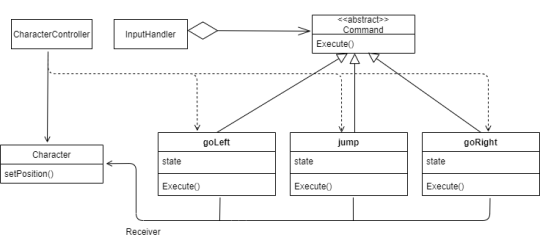
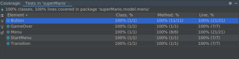

# LPOO 2020/2021 - Super Mario

## Group G84 elements

| Name                 | Number    | E-Mail                 |
| -------------------- | --------- | ---------------------- |
| Miguel Azevedo Lopes | 201704590 |up201704590@edu.fe.up.pt|
| Sofia Germer         | 201907461 |up201907461@edu.fe.up.pt|
| João Ferreira        | 201806716 |up201806716@edu.fe.up.pt|

## Table of contents
1. [How to Play](#how-to-play)
2. [Implemented Features](#implemented-features)
3. [GameShots](#game-shots)
4. [Design Patterns](#design-patterns)
	1. [Lanterna Facade](#lanterna-facade)
		1. [Problem in Context](#problem-in-context)
		2. [Implementation](#implementation)
		2. [The Pattern](#the-pattern)
		3. [Consequences](#consequences)
	2. [Game Loop](#game-loop)
		1. [Problem in Context](#problem-in-context-1)
		2. [Implementation](#implementation-1)
		2. [The Pattern](#the-pattern-1)
		3. [Consequences](#consequences-1)
	3. [Movement Command Pattern](#movementcommand-pattern)
		1. [Problem in Context](#problem-in-context-2)
		2. [Implementation](#implementation-2)
		2. [The Pattern](#the-pattern-2)
		3. [Consequences](#consequences-2)
	4. [Button Command Patter](#buttoncommand-pattern)
		1. [Problem in Context](#problem-in-context-3)
		2. [Implementation](#implementation-3)
		2. [The Pattern](#the-pattern-3)
		3. [Consequences](#consequences-3)
	5. [Changing Game States - State Pattern](#changing-game-states)
		1. [Problem in Context](#problem-in-context-5)
		2. [Implementation](#implementation-5)
		2. [The Pattern](#the-pattern-5)
		3. [Consequences](#consequences-5)
5. [Architectural Pattern](#architectural-pattern)
6. [Code Smells and Possible Refactoring](#code-smells-and-possible-refactorings)
	1. [Composing Methods](#composing-methods)
		1. [Extracting Variables](#extracting-variable)
		2. [Extracting Method](#extracting-method)
	2. [Simplifying Conditional Expressions](#simplifying-conditional-expressions)
		1. [Replace Nested Conditional with Guard Clauses](#replace-nested-conditional-with-guard-clauses)
	3. [Simplifying Method Calls](#simplifying-method-calls)
		1. [Rename Method](#rename-method)
7. [Adittional Features](#additional-features)
	1. [Mario Movements](#mario-movements)
	2. [Absolute Movement vs Relative Movement](#absolute-movement-vs-relative-movement)
8. [Tests](#tests)
9. [Self-Evaluation](#self-evaluation)

## How to Play
You can move the character using 
- `W` to jump upwards
- `D` to go right
- `A` to go left.

In order to jump while also moving right (to avoid holes in the ground) you need to first jump and then repeatedly move right
(first press `W` and then press `D` multiple times - the order in which you do it is important because it won't work if you try to go right and then jump.
This limitation exists because Lanterna doesn't recognize multiple inputs at the same time).

The main objective is to reach the flag at the end of the level.
  

## Implemented Features
Currently when you run the superMario, you'll see the Character (in this case Mario) at the center of the screen. 
- [x] Starting Menu
- [x] Game Over Menu
- [x] Between-Level Menu
- [x] Super Mario movement 
- [x] Blocks
- [x] Coins
- [x] Enemies with Different Movements
- [x] Lives System
- [x] Multiple Levels
- [x] Background Music

## Game Shots

## Design Patterns

### Lanterna Facade

#### Problem in Context
Frameworks are complex systems, since they have more features than those that those that will actually be used in a project. In this case, we developed a text-based superMario and used the Lanterna as its GUI framework.
Since the beginning  of the development of our code we take account to the following pattern. If instead of using a Design Pattern we used Lanterna's methods direclty, our code would be more complex and thightly coupled with the framework.

#### The Pattern

> Facade is a structural design pattern that provides a simplified interface to a library, a framework, or any other complex set of classes.

#### Implementation
 

**The classes can be found in the following files:**
> [GUI](../src/main/java/superMario/gui/GUI.java)
>
> [Lanterna GUI](../src/main/java/superMario/gui/LanternaGUI.java)

#### Consequences
- Improve code readability
- Provide a context-specific interface to more generic functionality

### Game Loop 
A superMario loop runs continuously during gameplay. In each iteration, it renders the image, processes user input **without blocking** and updates the superMario.
This is an important pattern to guarantee that the progression of the superMario is independent from user input and processor speed.
The behaviour of this loop is demonstrated in the following picture

#### Problem in Context

#### The Pattern
 
 > 1. Decouples the progression of game time from user input and processor speed.
 > 2. A game loop runs continuously during gameplay. Each turn of the loop, it processes user input without blocking, updates the game state, and renders the game. It tracks the passage of time to control the rate of gameplay.

#### Implementation

#### Consequences
- The game doesn't block in user input
- Frames are drawn consistently;
- Game variables are updated methodically;
- Allows for frame rate managament;
	

### MovementCommand Pattern

#### Problem in Context

#### The Pattern
> The command pattern "is a behavioral design pattern in which an object is used to encapsulate all information needed to perform an action or trigger an event at a later time". 
>
> Commands are an object-oriented replacement for callbacks 

#### Implementation
We implemented this pattern in the InputHandler class which will take user input and transform it into meaningful data in the superMario by executing a command. In this case, commands are objects that represent a superMario action.

**The classes can be found in the following files:**
> [Go Left](../src/main/java/superMario/controller/command/movementCommand/GoLeft.java)
>
> [Go Right](../src/main/java/superMario/controller/command/movementCommand/GoRight.java)
> 
> [Input Handler](../src/main/java/superMario/controller/command/movementCommand/InputHandler.java)
> 
> [Jump](../src/main/java/superMario/controller/command/movementCommand/Jump.java)
> 
> [Movement Command](../src/main/java/superMario/controller/command/movementCommand/MovementCommand.java)

#### Consequences

- Very useful to implement features such as "undo" and "redo"
- Using this pattern we have the possibility to bind different keys to certain actions. 
- It decouples the classes that invoke the operation from the object that knows how to execute the operation.

### ButtonCommand Pattern

#### Problem in Context

When implementing our Menus (The Start Menu, The Transition Menu and the Game Over Menu), we found ourselves in a situation where their Controllers had to interact with the buttons in the Model and change the Game state. However, neither the Models nor the View Controllers should know how to handle Game states.

#### The Pattern
Pattern explained [above](#the-pattern-2)

#### Implementation

This pattern was conceived by creating an abstract class ButtonCommand that receives a Game instance and operates on it. This class has a method execute that is implemented by each concrete ButtonCommand and is called to perform the defined operation. We defined 3 commands, Start, Restart and Exit. These are called by the View Controllers to change the Game State accordingly, without having to know how they are implemented and what they do.

**The classes can be found in the following files:**
>
> [Button Command](../src/main/java/superMario/controller/command/buttonCommand/ButtonCommand.java)
>
>[Exit Command](../src/main/java/superMario/controller/command/buttonCommand/ExitCommand.java)
>
> [Keep Playing Command](../src/main/java/superMario/controller/command/buttonCommand/KeepPlaying.java)
> 
> [Restart Command](../src/main/java/superMario/controller/command/buttonCommand/Restart.java)
> 
> [Start Command](../src/main/java/superMario/controller/command/buttonCommand/StartCommand.java)

#### Consequences
With the Command pattern we effectively decouple the View Controllers, which invoke the operations, from the objects that know how to perform them. We can easily add new Button Commands to our views, with the defined behaviour encapsulated inside them, without having to change anything in the View Controllers.

### Changing Game States - State Pattern

#### Problem in Context
We needed to alternate between various game states, such as: StateGameOver, StateMenu, StatePlay, StateTransition. Initially we thought about alternating between States through conditional logic. However this was obviously a violation of the **Single Responsability Principle** and the **Open Closed Principle**.

#### The Pattern
> Allow an object to alter its behavior when its internal state changes. The object will appear to change its class

#### Implementation

 

 **The classes can be found in the following files:**
> [State](../src/main/java/superMario/State.java)
>
> [State Game Over](../src/main/java/superMario/StateGameOver.java)
> 
> [State Menu](../src/main/java/superMario/StateMenu.java)
> 
> [State Play](../src/main/java/superMario/StatePlay.java)
> > 
> [State Menu](../src/main/java/superMario/StateTransition.java)

#### Consequences
- Easier to add a new state to the game
- Partioned and localized behaviour for different states
- Explicit state transition

### Architectural Pattern

#### Problem in Context
Right from the beginning of the development of the game we knew we had to separate in a correct way  the different components from our code. In this way, we chose the MVC structure since it was the most natural for us to apply.
In order to do this, we divided our code in three components:
- **Model:** Only represents the data.
- **Controller:** Provides model data to the view and interprets user actions.
- **View:** Displays the model data, and sends user actions to the controller.

#### The Pattern
>There are several different interpretations of what constitutes a MVC architecture.
The most important aspect is that the model represents the data, and does nothing else. The model does not depend on the controller or the view.
The controller can either serve as glue between the model and the view or just be a bridge between user interaction and the model.

#### Implementations
 

**The Model Classes can be found in the following files:**
> 
> [Position](../src/main/java/superMario/model/Position.java)
> 
>**Game Model**
>
> [Brick](../src/main/java/superMario/model/game/Brick.java)
> 
> [Character](../src/main/java/superMario/model/game/Character.java)
> 
> [Coin](../src/main/java/superMario/model/game/Coin.java)
> 
> [Dumb Enemy](../src/main/java/superMario/model/game/DumbEnemy.java)
> 
> [Enemy](../src/main/java/superMario/model/game/Enemy.java)
> 
> [Flag](../src/main/java/superMario/model/game/Flag.java)
> 
> [Info](../src/main/java/superMario/model/game/Info.java)
> 
> [Level](../src/main/java/superMario/model/game/Level.java)
> 
> [Map](../src/main/java/superMario/model/game/Map.java)
> 
> [Mario](../src/main/java/superMario/model/game/Mario.java)
> 
> [Moving Element](../src/main/java/superMario/model/game/MovingElement.java)
> 
> [Smart Enemy](../src/main/java/superMario/model/game/SmartEnemy.java)
> 
> [View Only Element](../src/main/java/superMario/model/game/ViewOnlyElement.java)
> 
>**Menu Model** 
>
> [Button](../src/main/java/superMario/model/menu/Button.java)
> 
> [Game Over](../src/main/java/superMario/model/menu/GameOver.java)
> 
> [Menu](../src/main/java/superMario/model/menu/Menu.java)
> 
> [Start Menu](../src/main/java/superMario/model/menu/StartMenu.java)
> 
> [Transition](../src/main/java/superMario/model/menu/Transition.java)

**The Viewer Classes can be found in the following files:**
> [Viwer](../src/main/java/superMario/viewer/Viewer.java)
> 
>**Game Model**
>
> [Brick Viewer](../src/main/java/superMario/viewer/game/BrickViewer.java)
> 
> [Character Viewer](../src/main/java/superMario/viewer/game/CharacterViewer.java)
> 
> [Coin Viewer](../src/main/java/superMario/viewer/game/CoinViewer.java)
> 
> [Element Viewer](../src/main/java/superMario/viewer/game/ElementViewer.java)
> 
> [Enemy Viewer](../src/main/java/superMario/viewer/game/EnemyViewer.java)
> 
> [Flag Viewer](../src/main/java/superMario/viewer/game/FlagViewer.java)
> 
> [Level Viewer](../src/main/java/superMario/viewer/game/LevelViewer.java)
> 
> [Map Viewer](../src/main/java/superMario/viewer/game/MapViewer.java)
> 
> [Music Player](../src/main/java/superMario/viewer/game/MusicPlayer.java)
> 
> [View Only Element Viewer](../src/main/java/superMario/viewer/game/ViewOnlyElementViewer.java)
> 
>**Menu Model** 
>
> [Game Over Viewer](../src/main/java/superMario/viewer/menu/GameOverViewer.java)
> 
> [Menu Viewer](../src/main/java/superMario/viewer/menu/MenuViewer.java)
> 
> [Transition Viewer](../src/main/java/superMario/viewer/menu/TransitionViewer.java)

**The Controller Classes can be found in the following files:**
> [Controller](../src/main/java/superMario/controller/Controller.java)
> 
>**Game Model**
>
> [Character Controller](../src/main/java/superMario/controller/game/CharacterController.java)
> 
> [Level Controller](../src/main/java/superMario/controller/game/LevelController.java)
> 
> [Play Controller](../src/main/java/superMario/controller/game/LevelController.java)
> 
>**Menu Model** 
>
> [Game Over Controller](../src/main/java/superMario/controller/game/GameOverController.java)
> 
> [Menu Controller](../src/main/java/superMario/controller/game/MenuController.java)
> 
> [Transition Controller](../src/main/java/superMario/controller/game/TransitionController.java)
> 
>**Commands** : The previously refered command classes ([Movement Command](#movementcommand-pattern) and [Button Command](#buttoncommand-pattern)) belong also to the controller component.

#### Consequences
- Increases the modularity of the code
- Easier to change only one component of the game, while still keeping all the others (This code structure respects the **Open-Closed Principle**)
- It also respect the **Single Responsability Principle** as each module has only one reason to change
- Allowed us to implement better testing
- Improved the overall organization of the code

## Code Smells and Possible Refactorings
If there's one thing we learned while developing the code for this delivery it's that there's always room for improvement. Over the past few weeks we changed our code numerous times, and we plan to continue to do so over the next weeks until our final delivery. With that in mind we will now list code smells that we intend to analyse in the future as well as possible refactorings. 

### Composing Methods 

#### Extracting Variable

In this first exemple we have a if statement with a **complicated expression** that is hard to read and understand.

 

To solve this issue we simply extract the variables out of the if statement.

 

#### Extracting Method
In this example we verified that the function "loadlevel" is a **Long Method** and does two separate things. 
1) It resets all variables of the level
2) It loads the new properties of a certain level

 

To remove this smell we can split the function into two function calls.

 

This code smell was also verified in the method "checkElementCollision" which is responsible for iterating all coins and all enemies 
and checking if the character is colliding with them. Again, to remove this smell we can simply create the functions "checkCoinCollision" and "checkEnemyCollision" which will a unique and more precise goal.

 
 

### Simplifying Conditional Expressions
#### Replace Nested Conditional with Guard Clauses

In this case, we have a **Long Method** with **complicated if operators** where it is hard to determine the normal flow of code execution.
To solve this issue we can introduce a guard clause for "for loops": the keyword *continue*;

 
 

### Simplifying Method Calls
#### Rename Method
In this case, by distraction we had non coherent Class Names.
The refactor was very easy, since we only needed to rename the classes.

 
 

## Additional Features 

In this section we'll take you through features we think are worth mentioning as well as problems that came up when developing the code.

### Mario Movements

**Mario Movements Lanterna Limitations and Thread Usage**
 When replicating the movements in the original Super Mario superMario we encountered a problem: in the original superMario, in order to jump forwards or backwards a player has to press two keys simultaneously, the key that moves Mario to the right or left, and the key that makes him jump, however Lanterna doesn't recognize multiple keys being pressed at the same time.

 Initially we considered using the `E` and `Q` key to jump diagonally, however we later decided the best solution was to implement threads to handle movement. Now, in order to handle diagonal jumps we take advantage of the time it takes to jump to create horizontal movement while the character is jumping.

### Absolute Movement vs Relative Movement
This was one of our most time-consuming problems: determining how the main character's movements relates to other objects and how they are drawn.

The way we display movement is by drawing the main Character at the center of the screen at all times. The movement illusion is generated by the map moving according to the Characters position in the map (the absolute position).

The problem we now faced was determining an object's position in the terminal. More concretely, if an object was positioned at absolute position x=1200, since the terminal's width is only 500 we needed a formula to calculate where to draw the element.
This is what we came up with:

- First, we check whether and element is in view (if its absolute position is within range of the Characters position, contained in [Characters.X-250, Characters.X+250]).

- If it is in view, we draw the element in a relative position given by the following formula: 
  
        Objects Relative X = Objects Absolute X - Characters Absolute X + 250

## Tests

### PIT TEST
 

### TEST
 

 

 

 

## Self-Evaluation

| Name                 |     Contribution     |
| -------------------- | -------------------- | 
| Miguel Azevedo Lopes |         1/3          |
| Sofia Germer         |         1/3          |
| João Ferreira        |         1/3          |
