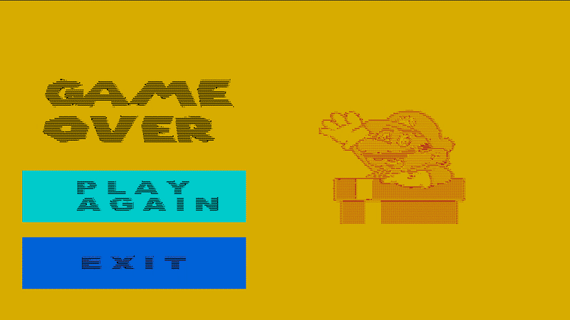
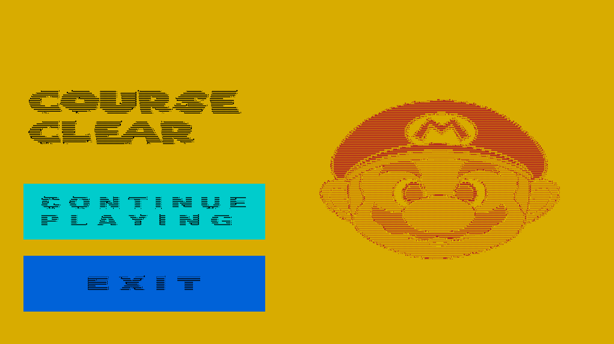
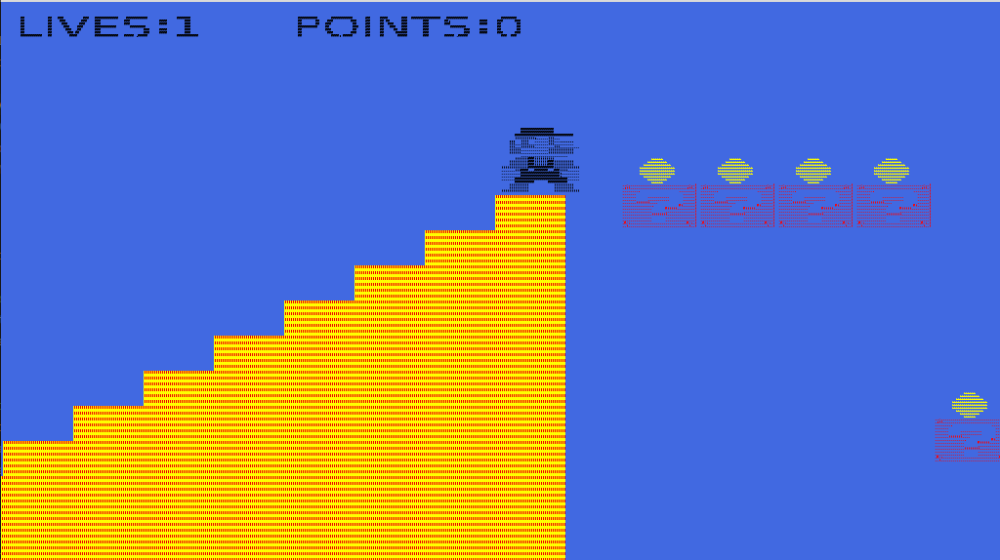
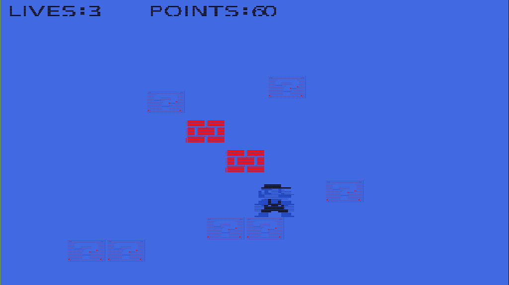

# LPOO 2020/2021 - Super Mario

## Group G84 elements

| Name                 | Number    | E-Mail                 |
| -------------------- | --------- | ---------------------- |
| Miguel Azevedo Lopes | 201704590 |up201704590@edu.fe.up.pt|
| Sofia Germer         | 201907461 |up201907461@edu.fe.up.pt|
| João Ferreira        | 201806716 |up201806716@edu.fe.up.pt|

## How to Play
You can move the character using 
- `W` to jump upwards
- `D` to go right
- `A` to go left.

In order to jump while also moving right (to avoid holes in the ground) you need to first jump and then repeatedly move right
(first press `W` and then press `D` multiple times - the order in which you do it is important because it won't work if you try to go right and then jump.
This limitation exists because Lanterna doesn't recognize multiple inputs at the same time).

The main objective is to reach the flag at the end of the level.
  

## Implemented Features
Currently when you run the superMario, you'll see the Character (in this case Mario) at the center of the screen. 
- [x] Starting Menu
- [x] Game Over Menu
- [x] Between-Level Menu
- [x] Super Mario movement 
- [x] Blocks
- [x] Coins
- [x] Enemies with Different Movements
- [x] Lives System
- [x] Multiple Levels
- [x] Background Music

## Game Shots

